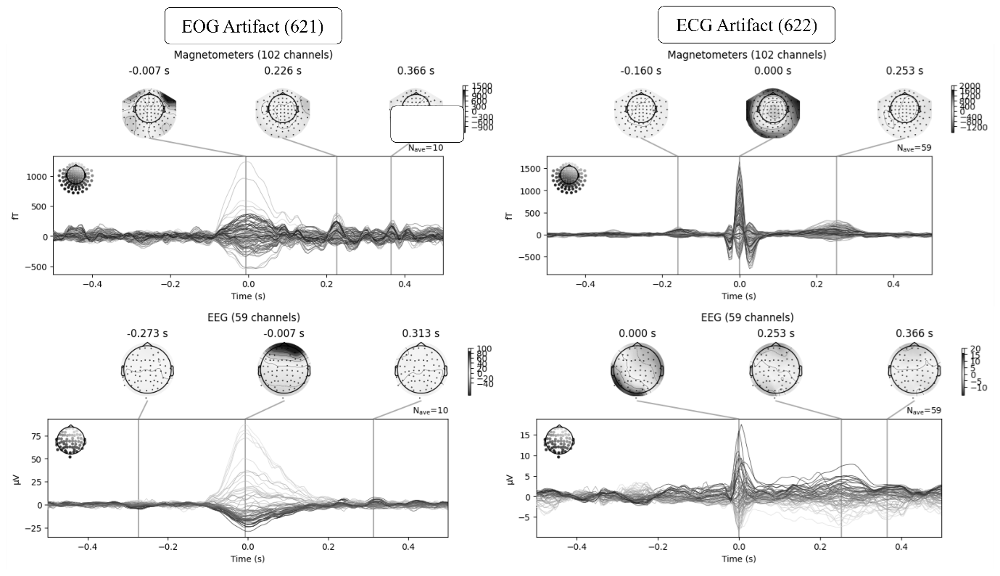
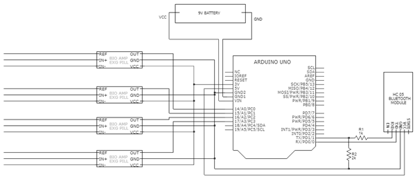

# 🧠 NeuroRoboControl (NRC)

> **An Affordable EEG‑Based Brain–Computer Interface for Robotic Control**
> *Patent‑backed research repository · BCI · Robotics · IoT · Deep Learning*

---

## 📌 Overview

This repository accompanies the patented invention:

> **NeuroRoboControl (NRC): Developing an Affordable EEG‑Based Robotic Control System**
> Filed under *The Patents Act, 1970 (India)* by **Symbiosis International (Deemed University)**.

The invention presents a **low‑cost, 12‑node EEG sensor system** capable of capturing **Motor Imagery Signals (MIS)** in real time and using them to **control a 4‑axis robotic arm** through a Brain–Computer Interface (BCI). The system integrates **embedded hardware**, **signal processing**, **deep learning**, and **IoT (MQTT)** to achieve accurate, real‑time operation with significantly reduced cost compared to conventional EEG systems.

⚠️ *This repository is shared for academic, research, and evaluation purposes only. It is associated with a patented invention.*

---

## 🎯 Key Contributions

* Design of a **12‑node low‑cost EEG brain sensor** using BioAmp EXG pills and Arduino
* Real‑time acquisition of **Motor Imagery EEG signals (12–35 Hz beta band)**
* Hardware‑ and software‑based **Signal Processing Unit (SPU)** for noise and artifact reduction
* Integration of **Deep Learning models** for:

  * Artifact removal (EOG, ECG, EMG)
  * Motor imagery classification
* **IoT‑enabled data pipeline** using MQTT for real‑time signal publishing
* Accurate **BCI‑based control of a 4‑axis robotic arm** via classified EEG signals

---

## 📂 Repository Structure

```
├── codes/
│   └── eeg_mqtt_interface.mat     # MATLAB file for real-time EEG acquisition & MQTT publishing
│
├── figures/
│   ├── figure_1.png               # EEG channels with EOG & ECG artifacts
│   ├── figure_2.png               # Working flow with prototype images
│   ├── figure_3.png               # 12-node electrode arrangement
│   ├── figure_4.png               # System-level schematic diagram
│   ├── figure_5.png               # BioAmp EXG pill + Arduino circuit diagram
│   └── figure_6.png               # Software architecture of NRC system
│
└── README.md
```

---

## 🧠 System Methodology

The NRC system follows a **hardware–software co‑design approach**, combining embedded EEG acquisition with edge/cloud‑based computation.

### 📐 Methodology & Architecture Figures


*Figure 1: Magnetometer readings along with EEG channels showing EOG and ECG artifacts in a motor imagery dataset.*


*Figure 2: End‑to‑end working flow of the proposed brain sensor system with actual prototype images.*


*Figure 3: Arrangement of wet and dry electrodes forming a 12‑node EEG acquisition system.*


*Figure 4: Schematic diagram illustrating integration of hardware, base station, computing station, and actuators.*


*Figure 5: Circuit diagram of BioAmp EXG pill interfaced with Arduino UNO R3.*


*Figure 6: Software architecture showing SPU, deep learning models, MQTT communication, and actuator control.*

---

## 🧪 EEG Acquisition & IoT Interface (`.mat` File)

The `codes` folder contains a **MATLAB (`.mat`) implementation** responsible for real‑time EEG data handling.

### Functional Description

The MATLAB module:

* Establishes **serial communication with Arduino‑based EEG hardware**
* Collects **real‑time EEG signals** from the 12‑node brain sensor
* Performs initial buffering and formatting of EEG data
* Publishes EEG streams to an **MQTT topic** for:

  * Edge / cloud‑based signal processing
  * Deep learning inference (artifact removal & classification)
* Enables **low‑latency, machine‑to‑machine (M2M) communication** between:

  * Brain sensor hardware
  * Base station (PC)
  * GPU / computing station

This IoT‑centric design allows the computationally intensive deep learning models to run independently of the sensing hardware, significantly reducing **on‑device cost and power consumption**.

---

## 🧠 Signal Processing & Learning Pipeline

* **Signal Processing Unit (SPU):**

  * High‑pass filter
  * Low‑pass filter
  * Median filter
  * Notch filter
  * Band‑pass filtering with wavelet denoising

* **Deep Learning Models:**

  * Model‑1: Real‑time artifact removal (EOG, ECG, EMG)
  * Model‑2: Motor imagery classification

* **Output:**

  * Classified EEG signals mapped to virtual joystick commands
  * Control of a **4‑axis robotic arm** using inverse kinematics

---

## 📈 Applications

* Brain‑controlled robotic arms
* Assistive robotics for differently‑abled users
* Human–machine interaction (HMI)
* Low‑cost BCI research and education
* Edge‑AI and IoT‑based biomedical systems

---

## 📜 Patent Notice

This repository is associated with a **patented invention**.

**All rights reserved.**
The contents are shared **strictly for academic review and research demonstration**. Commercial use, reproduction, or derivative works require **explicit written permission** from the patent holder.

---

## 👨‍🔬 Inventors

This invention is jointly developed by the following inventors (as per official invention disclosure):

1. **Nandakumar R.**

   * Email: [nandakumar.r.btech2021@sitpune.edu.in](mailto:nandakumar.r.btech2021@sitpune.edu.in) | [nandakumarkanchi@gmail.com](mailto:nandakumarkanchi@gmail.com)

2. **Vedant P. Mate**

   * Email: [vedant.mate.btech2021@sitpune.edu.in](mailto:vedant.mate.btech2021@sitpune.edu.in) | [vedantmate0110@gmail.com](mailto:vedantmate0110@gmail.com)

3. **Ramesh B. T.**

   * Email: [ramesh.bt@sitpune.edu.in](mailto:ramesh.bt@sitpune.edu.in) | [rameshbt049@gmail.com](mailto:rameshbt049@gmail.com)

4. **Javed K. Sayyad**

   * Email: [javed.sayyad@sitpune.edu.in](mailto:javed.sayyad@sitpune.edu.in) | [jksayyad23@gmail.com](mailto:jksayyad23@gmail.com)

5. **Arunkumar Bongale**

   * Email: [arun.bongale@sitpune.edu.in](mailto:arun.bongale@sitpune.edu.in) | [arunbongale1980@gmail.com](mailto:arunbongale1980@gmail.com)

---

## 📜 Patent Information

* **Patent Application Number:** **IN 202421050187**
* **Title:** *A COST-EFFECTIVE BRAIN-WAVE SENSOR SYSTEM FOR COLLECTING REAL-TIME MOTOR IMAGERY ELECTROENCEPHALOGRAM (EEG) DATA*
* **Jurisdiction:** India
* **Filed Under:** The Patents Act, 1970
* **Applicant:** Symbiosis International (Deemed University)

---

## 🤝 Collaboration

Researchers and academic collaborators interested in extending this work in the domains of **BCI, neuro‑robotics, and intelligent systems** are welcome to connect for research‑only discussions.
